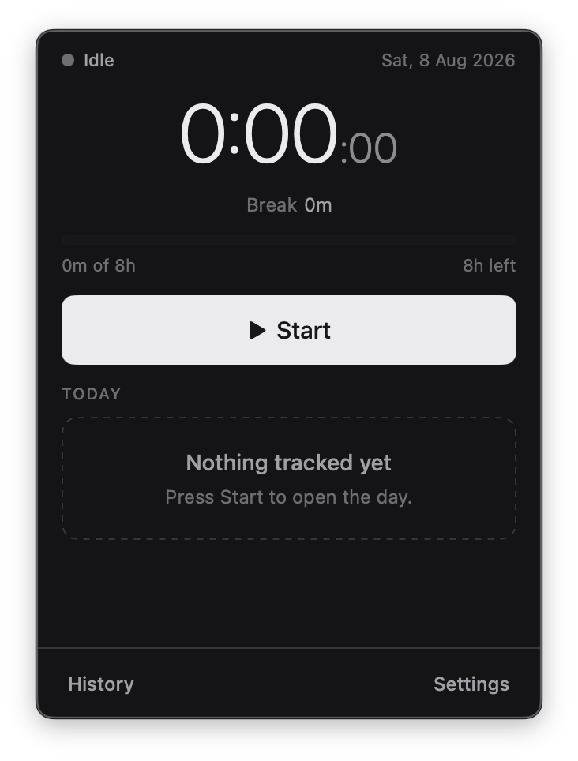
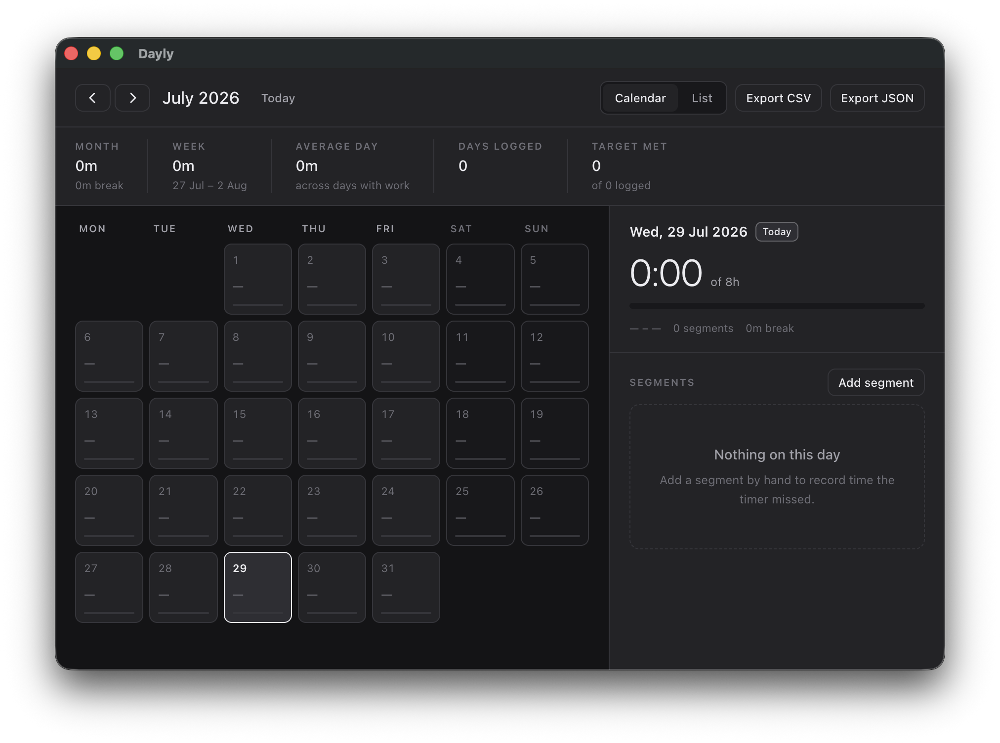

# Deylee

A local-first time tracker that lives in the macOS menu bar. Start the day, pause for a
coffee, end the day — Deylee keeps the running total beside its menu-bar icon and the full
history in a SQLite file you own.



Native Swift, SwiftUI and AppKit. No Electron, no Node, and `Package.swift` resolves no
remote dependencies at all.

## Installation

Deylee is pre-1.0 and there is no download yet, so building it is the way to install it.
It is three commands and no toolchain to assemble:

```sh
git clone https://github.com/faizrazadec/deylee.git
cd deylee
./scripts/make-app.sh                 # writes dist/Deylee.app
cp -R dist/Deylee.app /Applications/  # optional
```

You need **macOS 14 or newer** and the **Xcode Command Line Tools**
(`xcode-select --install`). Full Xcode is not needed.

There is no Homebrew cask and no signed release because the app has no Apple Developer ID
yet. Shipping unsigned is exactly what left the old Electron build unable to auto-update,
and repeating that is worse than waiting — see [Releasing](docs/INTERNALS.md#releasing).

## How does it work?

You start the day from the menu-bar item or the panel, and Deylee writes a `work` segment
to SQLite. Pausing closes it and opens a `break`; ending the day closes the last one. Every
total you see — the menu-bar title, the panel, the History window — is the sum of those
stored spans, recomputed from timestamps every second. There is no counter to drift, which
is what keeps the numbers right across a crash, a restart, a machine sleep or a DST change.

## Does my data leave my Mac?

Only hours, and only if you are signed in. Three things are ever sent:

- **Sync** — days and segments: when you started, when you stopped, work or break.
- **A heartbeat** while a timer is running — your device's id every 30 seconds and nothing
  else, so the server can vouch that the time was tracked live rather than typed in later.
- **Feedback**, only when you write some — your text, the app version and the macOS
  version.

Screen captures stay in the encrypted local store and have no upload path at all — grep
[`Sources/Deylee/SyncService.swift`](Sources/Deylee/SyncService.swift) for `capture` and
you will find nothing.

No telemetry, no analytics, no crash reporting.

Local-first is not local-only, and the difference is load-bearing: every write hits SQLite
on your disk first and the UI reads only from there, so the app tracks with no network at
all. Sync is a background reconciliation on top of that, never in front of it.

## Why does it need an account, then?

Signing in — with Google, or an email address and password — is needed once, to start a
day. After that the app runs offline indefinitely. The account exists so your history can reach your other devices — not so the
app can phone home.

## Where is my history kept?

In `~/Library/Application Support/deylee/deylee.sqlite`, which you can copy, inspect with
any SQLite browser, or delete. The History window exports CSV and JSON, and
`DataStore.backup` takes a consistent copy while the timer is running.



## What happens when I sleep, lock or walk away?

Deylee records only what it can account for. Sleep closes the open work segment at the
moment it happened; idle past your threshold opens the panel and asks whether to keep the
stretch or drop it; a segment crossing midnight is split so every stored segment belongs to
exactly one day. The full list, including what happens after a force-quit, is in
[Internals](docs/INTERNALS.md#the-awkward-cases-and-what-deylee-does-about-them).

## What is built, and what is not?

Every surface is built. What is missing is everything downstream of shipping it.

| Surface | Status |
|---|---|
| `DeyleeKit` — models, time maths, SQLite store, repository, timer engine | Complete, with tests |
| Menu-bar item, panel, mini window | Built |
| History window — calendar, roll-ups, manual edits, CSV/JSON export | Built |
| Settings window | Built |
| Recovery / idle / wake prompts, end-day confirmation | Built |
| System notifications | Not built — every prompt opens the panel instead |
| Sign-in and sync — Google or email and password | Built |
| Screen captures, kept encrypted on the Mac | Built |
| Update checking | Built on Sparkle, against a signed appcast |
| Sync API (`server/`) | Built and running |
| Signing, notarisation, distribution | Not started |

None of it has been through real use yet. The core is covered by tests; the windows have
been compiled and launched, not lived with. Bug reports from anyone who does live with it
are the most useful thing this repository can receive.

## Building from source

```sh
swift build            # compile DeyleeKit and the app
./scripts/test.sh      # run the suite — NOT bare `swift test`, see below
./scripts/make-app.sh  # assemble dist/Deylee.app (release by default; pass `debug`)
```

Every script re-enters the package it belongs to, so it can be run from anywhere.

`./scripts/test.sh` exists because the Command Line Tools ship `Testing.framework` but do
not put it on SwiftPM's search paths, so bare `swift test` fails with
`no such module 'Testing'`. The script passes the framework and rpath flags explicitly.

To point a development run at a throwaway store instead of your real history:

```sh
DEYLEE_DATA_DIR=/tmp/deylee-test ./dist/Deylee.app/Contents/MacOS/Deylee
```

The sync API is a separate Python package in [`server/`](server/), run with
[uv](https://docs.astral.sh/uv/) and Docker. Its suite is `./server/scripts/test-server.sh`;
the database tests need a local Postgres, which `./server/scripts/dev-db.sh` builds.

## Contributing

Issues and pull requests are welcome. [CONTRIBUTING.md](CONTRIBUTING.md) covers the layout,
the commit convention the repository enforces, and what a reviewable pull request looks
like. [`docs/INTERNALS.md`](docs/INTERNALS.md) explains why the app is built the way it is;
[`docs/MAC_REWRITE_SPEC.md`](docs/MAC_REWRITE_SPEC.md) and
[`docs/DESIGN.md`](docs/DESIGN.md) are binding on behaviour and on visuals, and
[`docs/SYNC_PROTOCOL.md`](docs/SYNC_PROTOCOL.md) on the wire between the app and the API.

## Troubleshooting

**`no such module 'Testing'` when running `swift test`.**
Expected with the Command Line Tools. Run `./scripts/test.sh` instead.

**Deylee refuses to start, saying the database was written by a newer version.**
You installed an older build over a database a newer one wrote, and it stopped rather than
corrupt your history. Install the newer version again — your data is exactly as you left
it. To run the older build anyway, move `deylee.sqlite` out of
`~/Library/Application Support/deylee/` first and keep it as an archive.

**Nothing was tracked while I was away.**
That is deliberate — see *What happens when I sleep, lock or walk away?* above.

## Licence

MIT © Muhammad Faiz Raza — see [LICENSE](LICENSE).
